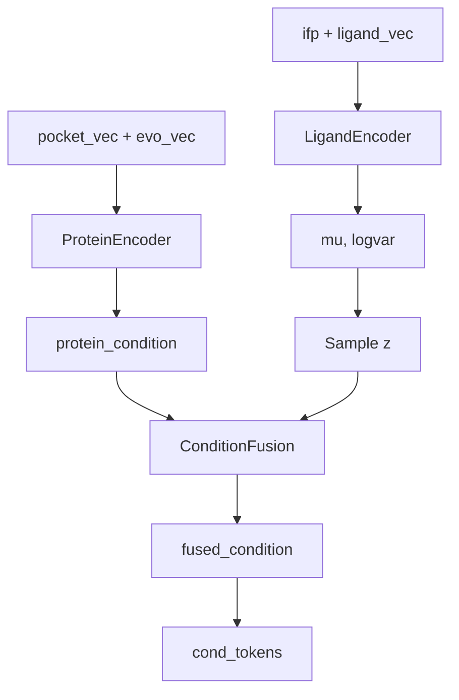
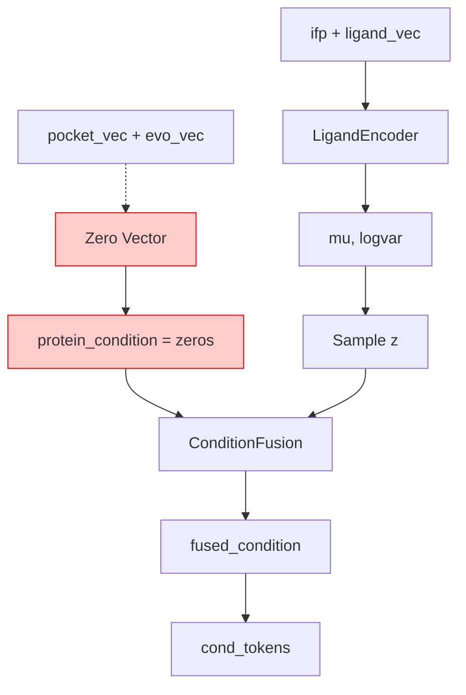

# Ablation Study: No Protein Encoder

## 概述 (Overview)

本文档记录了基于 `modeling_novomolgen_infonce_120225.py` 创建的 ablation study 模型。该模型移除了 `protein_encoder` 组件，使用零向量代替蛋白质条件编码，用于评估蛋白质编码器对模型性能的贡献。

## 文件位置

- **基础模型**: `src/models/modeling_novomolgen_infonce_120225.py`
- **Ablation 模型**: `src/models/modeling_novomolgen_infonce_120225_no_protein.py`

## 主要修改

### 1. 移除 Protein Encoder 初始化

**原代码** (第530-538行):
```python
# Protein encoder: takes pocket_vec [B, 512] and evo_vec [B, 1280], outputs protein condition [B, z_dim]
self.protein_encoder = create_protein_encoder(
    latent_dim=cond_latent_dim,
    protein_input_dim=cond_latent_dim,
    dropout=0.1,
    pocket_dim=512,
    evo_dim=1280,
    common_dim=cond_latent_dim,
    out_dim=cond_latent_dim,
)
```

**修改后**:
```python
# ABLATION: protein_encoder removed - will use zero vectors instead
# 不再初始化 protein_encoder
```

### 2. 使用零向量代替 Protein Condition

在 `forward` 方法中 (第859-867行):

**原代码**:
```python
# Process protein condition: pocket_vec + evo_vec -> protein_condition
if pocket_vec is not None and evo_vec is not None:
    protein_condition = self.protein_encoder(pocket_vec, evo_vec)
else:
    # Fallback to dummy protein condition
    cond_latent_dim = self.base_config.cond_tokens_len
    protein_condition = torch.zeros(bsz, cond_latent_dim, dtype=dtype, device=device)
    raise ValueError("No protein condition provided, breaking the training loop")
```

**修改后**:
```python
# ABLATION: Process protein condition - use zero vector instead of protein_encoder
cond_latent_dim = self.base_config.cond_tokens_len
protein_condition = torch.zeros(bsz, cond_latent_dim, dtype=dtype, device=device)
```

### 3. 修改 generate_with_condition 方法

在 `generate_with_condition` 方法中，所有使用 `protein_encoder` 的地方都替换为零向量:

**原代码** (第1257行):
```python
protein_condition = self.protein_encoder(pocket_vec, evo_vec)
```

**修改后**:
```python
# ABLATION: Use zero vector instead of protein_encoder
protein_condition = torch.zeros(bsz, cond_latent_dim, dtype=model_dtype, device=device)
```

### 4. 更新模块迭代器

#### `_iter_new_modules` 方法 (第573-575行)

**原代码**:
```python
for m in [getattr(self, 'ligand_encoder', None),
          getattr(self, 'protein_encoder', None),
          getattr(self, 'condition_fusion', None)]:
```

**修改后**:
```python
# ABLATION: Removed protein_encoder from the list
for m in [getattr(self, 'ligand_encoder', None),
          getattr(self, 'condition_fusion', None)]:
```

#### `_param_belongs_to_new_module` 方法 (第750-757行)

**原代码**:
```python
prefixes = [
    'transformer.cross_adapters',
    'transformer.gates',
    'ligand_encoder',
    'protein_encoder',  # 已移除
    'condition_fusion',
    'cond_proj',
]
```

**修改后**:
```python
prefixes = [
    'transformer.cross_adapters',
    'transformer.gates',
    'ligand_encoder',
    'condition_fusion',
    'cond_proj',
]
```

## 架构变化

### 原始架构数据流



### Ablation 架构数据流



**关键变化**:
- ❌ `ProteinEncoder` 被移除
- ✅ `LigandEncoder` 保持不变
- ✅ `ConditionFusion` **仍然保留**，但接收零向量作为 `protein_condition`
- ✅ 其他组件 (`cond_proj`, `infonce_hidden_proj`, `infonce_ligand_proj`) 保持不变

## 重要说明

### Condition Fusion 模块保留

虽然 `protein_encoder` 被移除，但 **`condition_fusion` 模块仍然保留**。这是因为:

1. **架构兼容性**: `condition_fusion` 的接口需要接收 `protein_condition` 和 `ligand_z` 两个输入
2. **零向量输入**: 使用零向量 `torch.zeros(bsz, cond_latent_dim)` 作为 `protein_condition` 输入
3. **评估目的**: 通过对比完整模型和 ablation 模型的性能，可以评估蛋白质信息对最终融合条件的影响

### 零向量的影响

当 `protein_condition` 为零向量时，`condition_fusion` 的行为:

- **Cross-attention**: 蛋白质条件作为 query，但由于是零向量，注意力机制主要关注 ligand 信息
- **融合输出**: 输出主要反映 ligand 条件，蛋白质信息被"消融"

## 使用方式

### 训练

```python
from src.models.modeling_novomolgen_infonce_120225_no_protein import NovoMolGen, NovoMolGenConfig

# 配置与原始模型相同
config = NovoMolGenConfig(
    enable_cross_attn=True,
    cross_layers=[3, 6, 9],
    cond_tokens_len=512,
    beta_kl=0.1,
    # ... 其他参数
)

# 创建 ablation 模型
model = NovoMolGen(config)

# 训练时，pocket_vec 和 evo_vec 仍然可以传入，但会被忽略
# 模型内部会使用零向量代替
```

### 推理

```python
# 生成时，pocket_vec 和 evo_vec 参数可以传入，但会被忽略
generated = model.generate_with_condition(
    input_ids=prompt_ids,
    pocket_vec=pocket_embedding,    # 会被忽略，使用零向量
    evo_vec=evo_embedding,          # 会被忽略，使用零向量
    ifp=interaction_fingerprint,    # 正常使用
    ligand_vec=ligand_representation, # 正常使用
    max_length=100,
    temperature=1.0,
)
```

## 对比实验

### 实验设计

1. **完整模型**: 使用 `modeling_novomolgen_infonce_120225.py`
   - 包含 `protein_encoder`
   - 使用真实的 `protein_condition`

2. **Ablation 模型**: 使用 `modeling_novomolgen_infonce_120225_no_protein.py`
   - 移除 `protein_encoder`
   - 使用零向量作为 `protein_condition`

### 评估指标

对比以下指标以评估蛋白质编码器的贡献:

- **生成质量**: 分子有效性、多样性
- **条件控制**: 对蛋白质条件的响应能力
- **训练稳定性**: Loss 曲线、收敛速度
- **下游任务**: Lead optimization、scaffold hopping 等任务性能

## 代码标记

所有修改位置都添加了 `ABLATION` 注释标记，便于识别:

```python
# ABLATION: protein_encoder removed - will use zero vectors instead
# ABLATION: Use zero vector instead of protein_encoder
# ABLATION: Removed protein_encoder from the list
```

## 文件对比

| 组件 | 原始模型 | Ablation 模型 |
|------|---------|--------------|
| `protein_encoder` | ✅ 存在 | ❌ 移除 |
| `ligand_encoder` | ✅ 存在 | ✅ 存在 |
| `condition_fusion` | ✅ 存在 | ✅ 存在 (接收零向量) |
| `cond_proj` | ✅ 存在 | ✅ 存在 |
| `protein_condition` | 来自 encoder | 零向量 |

## 注意事项

1. **训练数据**: 虽然 `pocket_vec` 和 `evo_vec` 会被忽略，但为了保持数据加载的一致性，建议仍然提供这些特征
2. **模型加载**: 如果从完整模型的 checkpoint 加载，`protein_encoder` 的权重会被忽略（因为模型中没有这个模块）
3. **条件融合**: `condition_fusion` 仍然会处理零向量输入，这可能会影响融合效果，但这是 ablation study 的预期行为

## 相关文档

- [NEW_ARCHITECTURE.md](NEW_ARCHITECTURE.md): 完整架构说明
- [CROSS_ATTENTION_DESIGN.md](CROSS_ATTENTION_DESIGN.md): 交叉注意力设计
- [CONDITION_FEATURES_GUIDE.md](CONDITION_FEATURES_GUIDE.md): 条件特征使用指南

## 总结

这个 ablation study 模型通过移除 `protein_encoder` 并使用零向量代替，可以评估:

1. **蛋白质信息的重要性**: 对比完整模型和 ablation 模型的性能差异
2. **条件融合的鲁棒性**: 评估 `condition_fusion` 在缺少蛋白质信息时的表现
3. **模型架构的灵活性**: 验证模型在部分条件缺失时的行为

通过对比实验，可以量化蛋白质编码器对最终生成质量的贡献，为模型优化提供指导。

